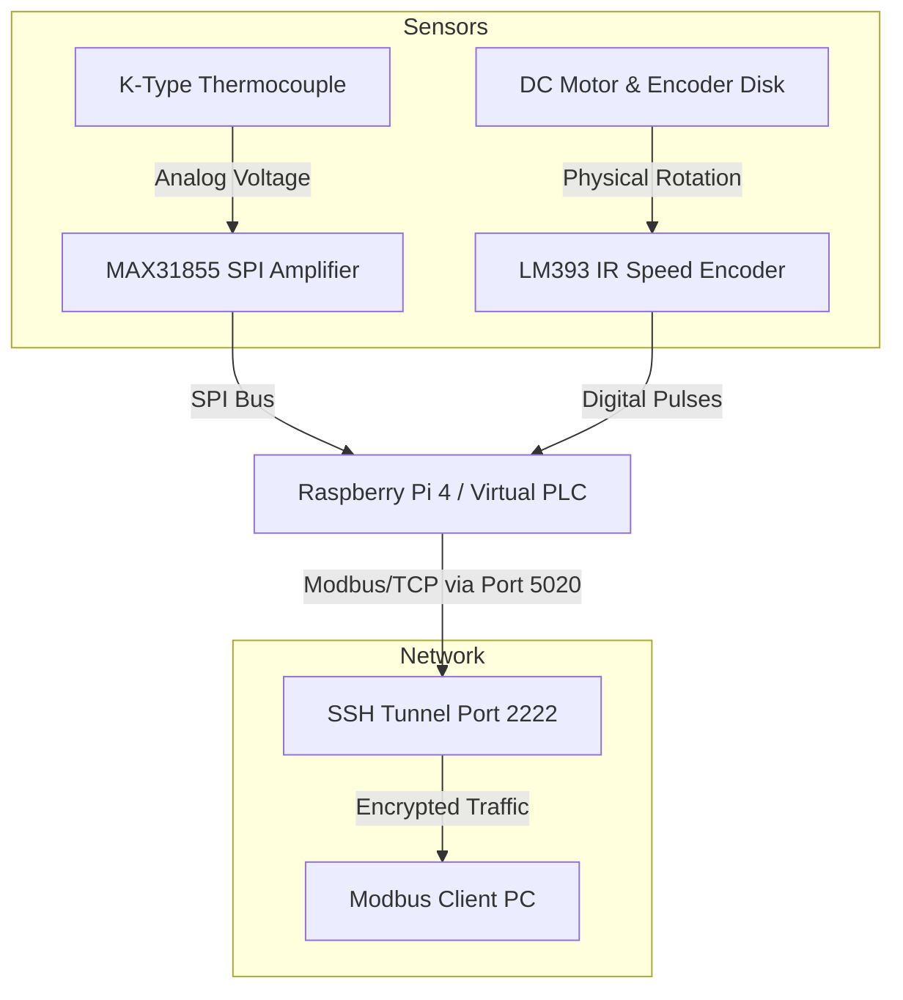

# Hardware Upgrade Plan: From Simulation to Physical Sensors

This document outlines the end-to-end plan to upgrade the current "Virtual PLC" Modbus Server from receiving simulated values (via the client) to reading real-time physical sensor data.

## 1. Architectural Changes

### Current Architecture (Simulated)
*   **Modbus Server (`modbus_server.py`):** Initializes a datastore with empty (0) holding registers. Runs on localhost.
*   **Modbus Client (`modbus_client.py`):** Generates random numbers for Boiler Temperature (75-80°C) and Motor Speed (1450-1500 RPM) and *writes* them to the server's registers over the network (or via SSH tunnel).

### Upgraded Architecture (Physical)
*   **Target Hardware:** Raspberry Pi (acting as the physical PLC/Modbus Server).
*   **Modbus Server (`modbus_server.py`):** Runs on the Raspberry Pi. A new background Python thread will read the physical sensors connected to the Pi's GPIO pins and update the local Holding Registers (HR 1 and HR 2).
*   **Modbus Client (`modbus_client.py`):** Will be updated to **read-only** mode. It will connect to the Pi (over the SSH tunnel) and simply read the actual physical values from the registers, removing the `client.write_register()` simulation logic.

---

## 2. Component Requirements

To implement this upgrade, you will need the following hardware:

1.  **Raspberry Pi (3B+, 4, or Zero 2 W):** The core controller running the Python Modbus server and SSH tunnel.
2.  **Boiler Temperature Sensor:** 
    *   **MAX31855 Amplifier + K-Type Thermocouple:** Highly recommended over standard thermistors or DS18B20 because boiling temperatures (100°C+) can degrade cheaper sensors. K-Type thermocouples can easily handle 500°C+.
3.  **Motor Speed Sensor:**
    *   **LM393 IR Optical Encoder / Tachometer:** Uses an infrared emitter/receiver and a slotted disk attached to the motor shaft. Each time a slot passes, it sends a digital pulse.
    *   *(Alternative)* **Hall Effect Sensor (e.g., A3144):** If using a magnet on the motor shaft instead of an optical disk.
4.  **Miscellaneous Prototyping Gear:**
    *   Breadboard
    *   Female-to-Female & Male-to-Female Jumper Wires
    *   A small DC Motor (if you are building a benchtop model to spin).

---

## 3. Wiring Diagram & Schematics

The sensors will interface directly with the Raspberry Pi GPIO header.

### Block Diagram



### Pin/Wiring Mapping (Raspberry Pi to Sensors)

| Sensor Module | Module Pin | Raspberry Pi Pin | Notes |
| :--- | :--- | :--- | :--- |
| **MAX31855 (Temp)** | VCC | 3.3V (Pin 1) | Powers the amplifier logic. |
| **MAX31855 (Temp)** | GND | GND (Pin 9) | Ground. |
| **MAX31855 (Temp)** | DO / MISO | GPIO 9 (Pin 21) | SPI Master In Slave Out. |
| **MAX31855 (Temp)** | CS | GPIO 8 (Pin 24) | SPI Chip Select 0. |
| **MAX31855 (Temp)** | CLK | GPIO 11 (Pin 23) | SPI Clock. |
| **LM393 (Speed)** | VCC | 3.3V (Pin 17) | Power for IR sensor. |
| **LM393 (Speed)** | GND | GND (Pin 14) | Ground. |
| **LM393 (Speed)** | DO (Digital Out) | GPIO 17 (Pin 11) | Outputs a high/low pulse on each rotation. |

---

## 4. Implementation Steps (Software)

To integrate this hardware with your `Combined_Project_Code.py`, follow these steps:

### Step 1: Install Hardware Libraries
On the Raspberry Pi, you need libraries to read the SPI thermocouple and handle GPIO interrupts for the motor speed.
```bash
pip install adafruit-circuitpython-max31855 RPi.GPIO
```

### Step 2: Update `Combined_Project_Code.py` (Server Section)
Modify the `# modbus_server.py` section to include a background thread that reads the sensors and updates the datastore context.

```python
import threading
import time
import RPi.GPIO as GPIO
import board
import busio
import digitalio
import adafruit_max31855

# --- Motor Speed Global Variables ---
pulse_count = 0
pulse_lock = threading.Lock()
rpm = 0

def rpm_callback(channel):
    global pulse_count
    with pulse_lock:
        pulse_count += 1

# --- Background Sensor Task ---
def sensor_updater(context):
    global pulse_count, rpm
    
    # 1. Setup Temp Sensor (SPI)
    spi = busio.SPI(board.SCK, MOSI=board.MOSI, MISO=board.MISO)
    cs = digitalio.DigitalInOut(board.D5)
    max31855 = adafruit_max31855.MAX31855(spi, cs)
    
    # 2. Setup Speed Sensor (GPIO Interrupt)
    TACHO_PIN = 17
    GPIO.setmode(GPIO.BCM)
    GPIO.setup(TACHO_PIN, GPIO.IN, pull_up_down=GPIO.PUD_UP)
    GPIO.add_event_detect(TACHO_PIN, GPIO.FALLING, callback=rpm_callback)
    
    while True:
        # Safely read and reset pulse count to avoid race conditions
        with pulse_lock:
            current_pulses = pulse_count
            pulse_count = 0
            
        # Calculate RPM (Assuming 1 second loop and 20 slots per encoder disk)
        rpm = (current_pulses / 20) * 60
        
        # Read Temp
        try:
            temp_c = int(max31855.temperature)
        except RuntimeError:
            temp_c = 0
            
        # Update Modbus Registers
        # hr[1] = Boiler Temp, hr[2] = Motor Speed
        register_id = 3 # Holding Registers
        context[0].setValues(register_id, 1, [temp_c])
        context[0].setValues(register_id, 2, [int(rpm)])
        
        time.sleep(1)
```
*You will need to call `threading.Thread(target=sensor_updater, args=(context,), daemon=True).start()` inside `run_server()` right before `await StartAsyncTcpServer(...)`.*

### Step 3: Update `Combined_Project_Code.py` (Client Section)
In the `# modbus_client.py` section, remove the simulation logic where the client uses `client.write_register(...)`. The client should only execute reads:
```python
            # Read them back
            temp_result = client.read_holding_registers(temp_address, count=1)
            if not temp_result.isError():
                log.info(f"Read Boiler Temp from register {temp_address}: {temp_result.registers[0]}°C")
                
            speed_result = client.read_holding_registers(speed_address, count=1)
            if not speed_result.isError():
                log.info(f"Read Motor Speed from register {speed_address}: {speed_result.registers[0]} RPM")
```
