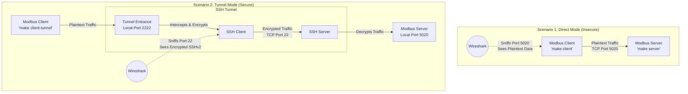

# Embedded Security – MASTER Applied Computer Science
## Project Report: SSH Tunneling for Modbus/TCP protocol

### 1. Introduction and Research
**Modbus/TCP** is a de facto standard in industrial automation. Based on the original serial Modbus protocol, Modbus/TCP wraps the Modbus application data unit (ADU) within a TCP/IP packet, allowing it to be transmitted over standard Ethernet networks. It operates on a client/server (formerly master/slave) architecture, typically using port 502 (or 5020 in our test environment).

**Security Flaws:**
Despite its widespread adoption in Critical Infrastructure (SCADA systems, PLCs, sensors), Modbus/TCP lacks fundamental security mechanisms:
*   **No Encryption:** Data is transmitted in plaintext, allowing attackers to eavesdrop on the network and read sensitive operational data.
*   **No Authentication:** The server does not verify the identity of the client. Any device on the network can send commands to the server.
*   **No Integrity Checks:** There is no mechanism to detect if a packet was altered in transit.
*   **Replay Attacks:** An attacker can capture legitimate commands and replay them later to cause unauthorized actions.

To mitigate these vulnerabilities without altering the underlying Modbus/TCP protocol implementation, we can wrap the traffic in an encrypted tunnel using **SSH (Secure Shell)**.

### 2. Test Setup Architecture
Our test setup simulates a basic industrial environment:
*   **Modbus Server (`modbus_server.py`):** Acts as a Virtual PLC holding registers. It runs locally and listens on port `5020`.
*   **Modbus Client (`modbus_client.py`):** Acts as the HMI or control system, connecting to the server to read and write register values.
*   **Network:** Both run on the loopback interface (`127.0.0.1`), allowing us to capture traffic easily.

**Architecture Diagram:**



### 3. SSH Tunneling Implementation
SSH tunneling (specifically Local Port Forwarding) allows us to create a secure, encrypted connection between a local port and a remote destination port.

**Mechanism:**
1.  The SSH Client connects to an SSH Server.
2.  The SSH Client opens a local listening port (e.g., `2222`).
3.  Any traffic sent to `localhost:2222` is intercepted by the SSH Client, encrypted, and sent through the SSH tunnel to the SSH Server.
4.  The SSH Server decrypts the traffic and forwards it to the final destination (e.g., `localhost:5020`).

**Implementation Command:**
In a real-world scenario where the Modbus Client and Server are on different machines, the command executed on the Client machine would look like this:
```bash
ssh -L 2222:localhost:5020 user@<modbus_server_ip>
```
*   `-L`: Specifies Local Port Forwarding.
*   `2222`: The local port the Modbus Client will connect to.
*   `localhost:5020`: The destination the SSH server will forward traffic to (the Modbus Server).

**Client Modification:**
To use the tunnel, the Modbus Client script simply changes its target configuration:
*   Original: `Connect to 127.0.0.1:5020`
*   Tunneled: `Connect to 127.0.0.1:2222`

### 4. Evaluation and Traffic Analysis
Using Wireshark, we compared the network traffic of both scenarios.

**Scenario A: Without SSH Tunnel (Plaintext)**
*   The Modbus Client connects directly to port `5020`.
*   In Wireshark, filtering for `tcp.port == 5020` reveals packets identified as the "Modbus/TCP" protocol.
*   Inspecting the payload clearly shows the Function Codes (e.g., Write Single Register, Read Holding Registers) and the exact data values being transmitted in plain text. An attacker could easily see and inject malicious Modbus packets.

**Scenario B: With SSH Tunnel (Encrypted)**
*   The Modbus Client connects to port `2222`, which is forwarded via SSH.
*   In Wireshark, filtering for the Modbus port (`tcp.port == 5020`) shows **no traffic** from the remote client's IP, because the traffic is hidden inside the SSH connection.
*   Filtering for the SSH port (`tcp.port == 22`) reveals only generic SSHv2 encrypted packets. The Modbus payload is completely unreadable, protecting against eavesdropping and tampering.

### 5. Feasibility on Embedded Systems
Implementing SSH on embedded systems (like edge devices, sensors, or older PLCs) presents several challenges due to limited resources.

*   **CPU Overhead:** SSH uses strong cryptographic algorithms (e.g., AES, ChaCha20, RSA/Ed25519) for encryption, decryption, and key exchange. This requires significant CPU cycles, which can strain low-power microcontrollers.
*   **Memory Constraints:** The SSH daemon (e.g., Dropbear, OpenSSH) requires RAM and Flash storage. While lightweight options like Dropbear exist, they still consume resources that might be scarce on deeply embedded devices.
*   **Latency & CPU Benchmarking:** The cryptographic operations add latency to the communication. Modbus/TCP is often used in real-time environments where latency jitter can cause system instability. *As part of this project, a `modbus_benchmark.py` script was developed to measure this exact overhead. By sending consecutive read requests, we can quantitatively observe the increase in average round-trip time and CPU usage when the data is routed through the SSH tunnel compared to the direct plaintext connection.* 
    *   **Visual Data:** The benchmark script utilizes `psutil` and `matplotlib` to automatically generate side-by-side bar charts (`benchmark_results.png`) clearly illustrating the performance penalty of encryption.
*   **Key Management:** Securely storing and managing private SSH keys on an embedded device is difficult. If the device is physically compromised, the keys might be extracted.

**Conclusion on Feasibility:**
While highly effective for security, standard SSH tunneling is generally **not feasible for deeply embedded systems** (e.g., Cortex-M microcontrollers) due to resource constraints. 
However, it is highly feasible and recommended for **Edge Gateways**, industrial PCs, or modern high-end PLCs (e.g., running embedded Linux), which have sufficient resources to act as a secure proxy for the legacy Modbus network. For highly constrained devices, lighter alternatives like TLS/DTLS (potentially with hardware acceleration) or IPsec might be preferred, though they also carry overhead.
