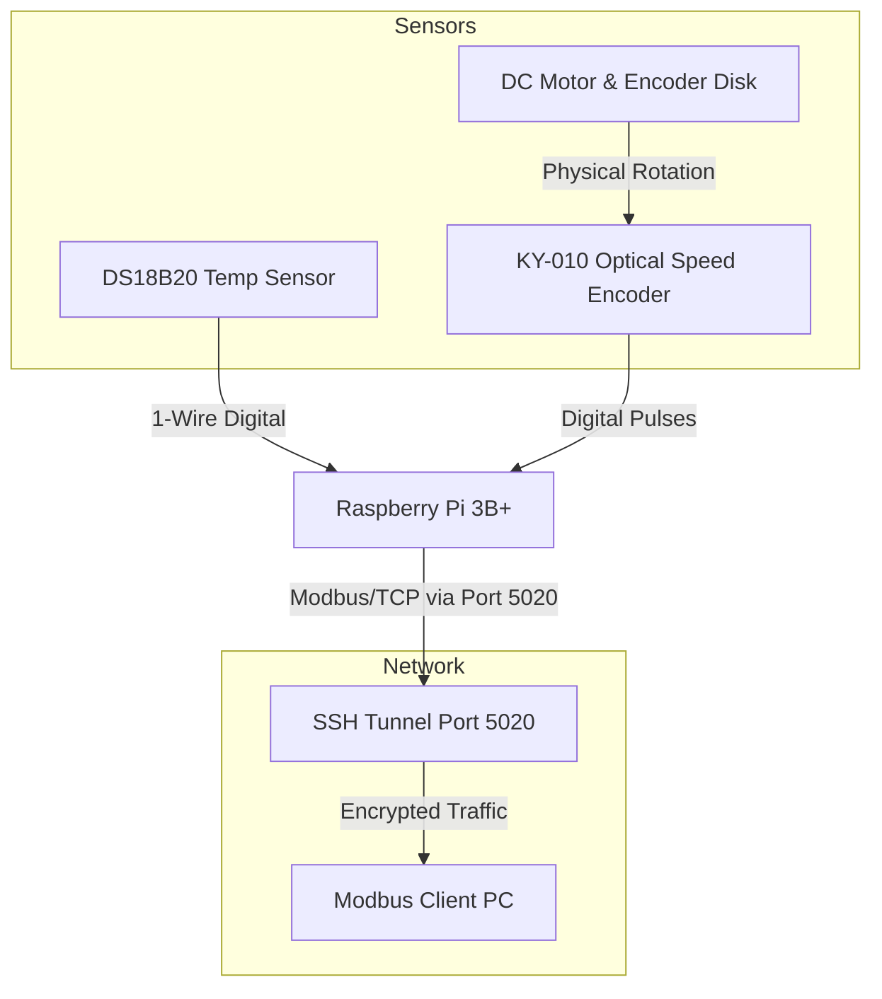

# Hardware Upgrade Plan: From Simulation to Physical Sensors

This document outlines the end-to-end process of upgrading the current "Virtual PLC" Modbus Server from receiving simulated values to reading real-time physical sensor data on a Raspberry Pi.

## 1. Architectural Changes

### Upgraded Architecture (Physical)
*   **Target Hardware:** Raspberry Pi (acting as the physical PLC/Modbus Server).
*   **Modbus Server (`hardware_server.py`):** Runs on the Raspberry Pi. A background Python thread reads the physical sensors connected to the Pi's GPIO pins and updates the local Holding Registers (HR 1 and HR 2).
*   **Modbus Client (`hardware_client.py`):** Runs on the remote PC. It establishes an SSH tunnel to the Pi and connects to the Modbus server over the encrypted tunnel in **read-only** mode to fetch physical values.

---

## 2. Component Requirements

To implement this upgrade, you will need the following hardware from the 37-in-1 Sensor Kit:

1.  **Raspberry Pi (3B+):** The core controller running the Python Modbus server and SSH tunnel.
2.  **Boiler Temperature Sensor (KY-001 / DS18B20):** 
    *   A highly accurate 1-Wire digital temperature sensor.
3.  **Motor Speed Sensor (KY-010):**
    *   **Optical Broken Module:** Uses an infrared emitter/receiver and a slotted disk attached to the motor shaft. Each time a slot passes, it sends a digital pulse which the Pi counts via GPIO interrupts.
4.  **Miscellaneous Prototyping Gear:**
    *   Female-to-Female Jumper Wires.

---

## 3. Wiring Diagram & Schematics

The sensors interface directly with the Raspberry Pi GPIO header.

### Block Diagram



### Pin/Wiring Mapping (Raspberry Pi to Sensors)

| Sensor Module | Module Pin | Raspberry Pi Pin | Notes |
| :--- | :--- | :--- | :--- |
| **DS18B20 (Temp)** | `-` (Ground) | GND (Pin 6) | Ground. |
| **DS18B20 (Temp)** | Center (Power) | 3.3V (Pin 1) | Powers the sensor. |
| **DS18B20 (Temp)** | `S` (Signal) | GPIO 4 (Pin 7) | 1-Wire Digital Data bus. |
| **KY-010 (Speed)** | `-` (Ground) | GND (Pin 14) | Ground. |
| **KY-010 (Speed)** | Center (Power) | 3.3V (Pin 17) | Power for IR sensor. |
| **KY-010 (Speed)** | `S` (Signal) | GPIO 17 (Pin 11) | Outputs a high/low pulse on each rotation. |

---

## 4. Raspberry Pi Setup & Software Execution

Follow these steps to configure the Raspberry Pi and run the hardware Modbus server.

### Step 1: Flash the OS and Connect via VS Code
1. Flash **Raspberry Pi OS (32-bit)** onto a 16GB Micro SD Card using Raspberry Pi Imager.
2. Ensure you enable **SSH** and configure your **Wi-Fi** in the Imager settings.
3. Boot the Pi, wait 60 seconds, and use **VS Code Remote-SSH** to connect to `pi@raspberrypi.local` from your Mac.

### Step 2: Enable 1-Wire for the Temperature Sensor
The DS18B20 requires a special communication protocol called 1-Wire, which is disabled by default on the Raspberry Pi.
1. Open the VS Code terminal (connected to the Pi) and run:
   ```bash
   sudo raspi-config
   ```
2. Navigate to **Interface Options** -> **1-Wire**.
3. Select **Yes** to enable it.
4. Exit the tool and reboot the Raspberry Pi if prompted.

### Step 3: Install Hardware Dependencies
Once reconnected, transfer the `SSH Modbus Hardware Execution` folder to the Pi and install the required Python libraries:
```bash
pip3 install -r requirements.txt
```
*(This installs `pymodbus`, `sshtunnel`, `w1thermsensor`, and `RPi.GPIO`)*

### Step 4: Run the Server
On the Raspberry Pi terminal, start the hardware Modbus server:
```bash
python3 hardware_server.py
```
*The server will begin polling the GPIO pins and listening on `127.0.0.1:5020`.*

### Step 5: Run the Client over SSH
On your **Mac** (not on the Pi), run the client script. It will automatically build an encrypted SSH tunnel to the Pi and fetch the physical data.
```bash
python3 hardware_client.py
```
